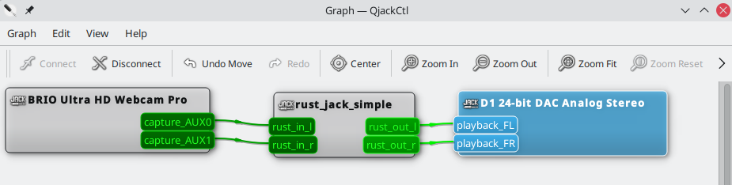

# Quickstart

## JACK Background

The `jack` crate provides Rust bindings to the [JACK](http://jackaudio.org)
API. Typically, a JACK server is started and clients connect to it to gain
access to audio and midi inputs and outputs, along with synchronization
mechanisms and APIs.


flowchart TD;
    ClientA --- JackServer;
    ClientB --- JackServer;
    YourClient --- JackServer;
    JackServer --- AudioDevices;
    JackServer --- MidiDevices


The JACK server is responsible for:
- Discovering and exposing audio and midi devices.
- Synchronizing audio and midi data.
- Managing the processing graph.

JACK clients are responsible for:
- Registering themselves with JACK.
- Registering callbacks to provide audio/midi data to the JACK server.

## JACk Server

There are two Linux implementations tested with the `jack` crate.

- JACK2 - The primary implementation of JACK. Can use realtime scheduling and
  alsa under the hood to provide the best latency. The JACK2 server may be
  started through the `jackd` CLI or `qjackctl` GUI.
- Pipewire - The most commonly used audio & video stream server for Linux. May
  not provide the best latency, but is very convenient to use. Pipewire itself
  has its own API, but it also exposes a JACK server. `pw-jack` is often used to
  patch in Pipewire's JACK implementation. For example, you can run your Rust
  JACK app with: `pw-jack cargo run`.

## JACK Clients

This is where the `jack` crate comes in. Once a JACK server is running on the
system, you can run your client to produce audio. Here is a simple `jack`
program that can take inputs and forward them to outputs.

```rust
fn main() {
    // 1. Create client
    let (client, _status) =
        jack::Client::new("rust_jack_simple", jack::ClientOptions::NO_START_SERVER).unwrap();

    // 2. Register ports. They will be used in a callback that will be
    // called when new data is available.
    let in_a: jack::Port<jack::AudioIn> = client
        .register_port("rust_in_l", jack::AudioIn::default())
        .unwrap();
    let in_b: jack::Port<jack::AudioIn> = client
        .register_port("rust_in_r", jack::AudioIn::default())
        .unwrap();
    let mut out_a: jack::Port<jack::AudioOut> = client
        .register_port("rust_out_l", jack::AudioOut::default())
        .unwrap();
    let mut out_b: jack::Port<jack::AudioOut> = client
        .register_port("rust_out_r", jack::AudioOut::default())
        .unwrap();
    let process_callback = move |_: &jack::Client, ps: &jack::ProcessScope| -> jack::Control {
        let out_a_p = out_a.as_mut_slice(ps);
        let out_b_p = out_b.as_mut_slice(ps);
        let in_a_p = in_a.as_slice(ps);
        let in_b_p = in_b.as_slice(ps);
        out_a_p.clone_from_slice(in_a_p);
        out_b_p.clone_from_slice(in_b_p);
        jack::Control::Continue
    };
    let process = jack::ClosureProcessHandler::new(process_callback);

    // 3. Activate the client, which starts the processing.
    let active_client = client.activate_async((), process).unwrap();

    // 4. Wait for user input to quit
    println!("Press enter/return to quit...");
    let mut user_input = String::new();
    io::stdin().read_line(&mut user_input).ok();

    // 5. Not needed as the async client will cease processing on `drop`.
    active_client.deactivate().unwrap();
}
```

## Connecting Ports

1. Run the JACK client using the Pipewire JACK server.
   ```sh
   pw-jack cargo run
   ```
2. View the JACK processing graph. This can be done by using the `qjackctl` GUI
   and clicking Graphs.
   ```sh
   pw-jack qjackctl
   ```
3. Connect the ports as you see fit! In the below, a webcam microphone is
   connected to the speakers. Warning, do not try this at home! Connecting a
   microphone input to a speaker output may produce a terrible echo.
   
